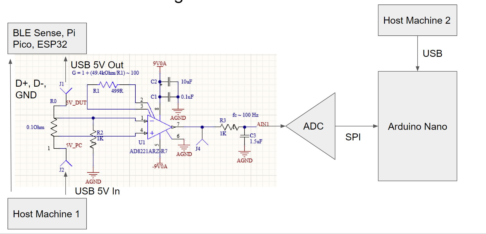
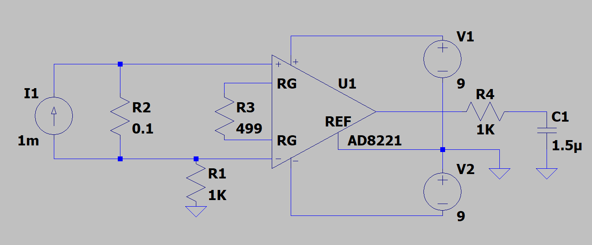
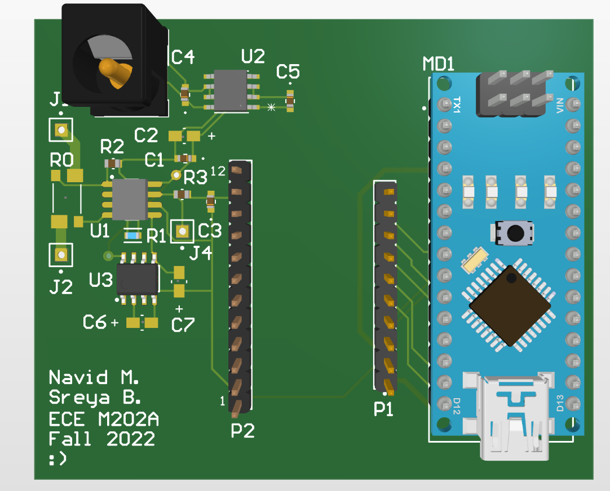
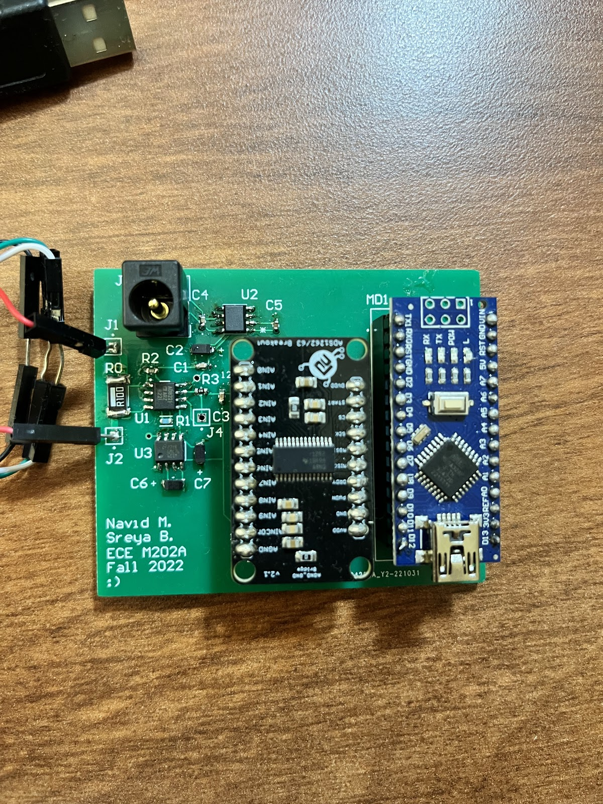
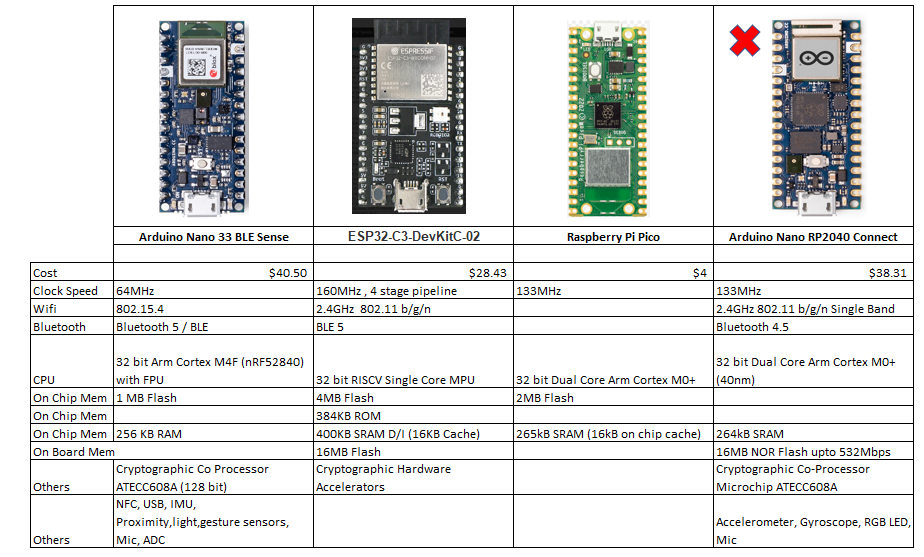
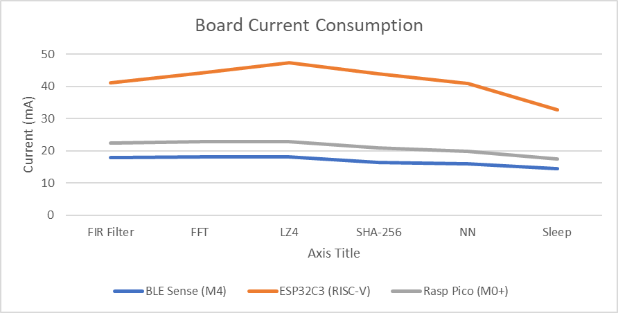
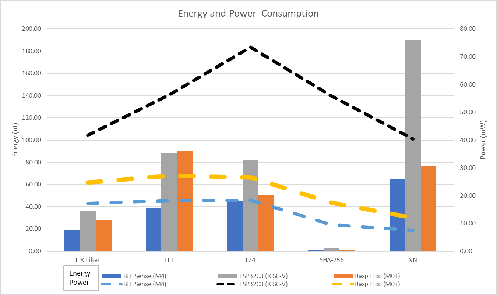
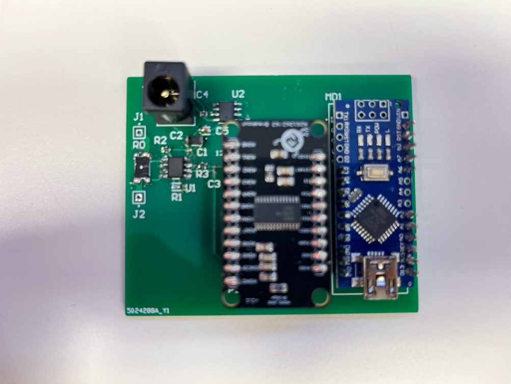

**Horizontal Power Comparison of Commonly Used Micro Controller Boards**

Google Drive: <https://drive.google.com/drive/folders/1zpd2A9vdD_L1s2i-tXj2ZQ2Z_FPMoxEz>

This project consists of two aspects:

1) A custom-designed power measuring platform

2) ZephyrOS-based computation tests

Our goal is to characterize power performance of ZephyrOS based computational tasks on three different boards with different architectures. The boards are the Arduino Nano 33 BLE Sense (ARM M4), ESP32C3 (RISCV), and Raspberry Pi Pico (ARM M0+). To achieve this, we sought to create our own custom power monitoring board that can measure currents from 100’s of nA to 100’s of mA.

Custom Power Measuring Platform

The custom hardware platform uses a current sense resistor in series with the USB bus voltage that powers the platform to test. The goal is to measure currents from 100’s of nA to 100’s of mA. The current becomes a voltage with a gain of 0.1V/A that is amplified by an instrumentation amplifier with a gain of 100. The output voltage is then sampled by a 32-bit ADC at 20 SPS. A schematic of this is shown in Fig. 1.

Fig. 1. Hardware Schematic

To minimize thermal noise, traces are kept short, and resistances are kept small. The purpose of R2 is to provide a DC path to ground for the input of the amplifier [1]. R3 and C3 provide a low pass filter to reduce aliasing to the ADC, but the ADC has a built-in filter bank [2]. In our case, it is configured as an FIR filter.

Initial problems with the board were that the amplifier was configured with single-ended supply. A charge pump was added to produce a second negative supply. Analog functionality was verified with an LTspice simulation with the schematic shown in Fig. 2. The complete board CAD model is shown in Fig. 3 and an image of it is shown in Fig. 4.

Fig. 2 LTspice Simulation Schematic

Fig. 3 Complete Board CAD

Fig. 4 Complete Board

The LTspice schematic files is found in hardware/LTSpice and the Altium design files for the board are in hardware/Altium.

The next order of business is to write the Arduino code that reads the ADC samples and does the offset calculation. The base of the code is from [3], but this code had many issues that had to be rectified. The driver given is modified so that the proper channel is used, along with 20SPS sampling and an FIR filter. According to [2], this would give an effective number of bits of 24.6. At a reference voltage of 2.5V, this would mean the ADC resolution would be

The voltage that the ADC measures corresponds to the voltage produced after the current passes through the resistor and then amplified by the instrumentation amplifier:

Thus, the voltage measured corresponds to ten times the current, and the minimum current we can resolve is .

The calibration steps start upon startup of the Arduino code and start with discarding the first 100 samples to reach steady state, and then using the next 100 samples to find an average value to subtract off. Upon doing so, the measurements have a mean of and a variance of . There is some error in the no load measurements, and these can come from a variety of sources. These include power supply noise, thermal noise, and the resistive losses in the cables and wires used. The USB cable used to connect the device under test is particularly long.

The samples are written to the serial port, which are then read with PuTTy and written into a file where they are then pasted into excel to find the average. The Arduino code is in src/Arduino.

For the current measurements, 250 samples are averaged.

ZephyrOs-based Computation Tests

There are several tests that are used to test power consumption.

1.  FIR (10 tap, 64 pts)
2.  FFT (32 pt)
3.  LZ4 Compression ("Lorem ipsum dolor sit amet, consectetur…”)
4.  SHA256 Encryption (“abc”)
5.  TFlite Sine Estimation Model
6.  BLE Broadcast (For BLE devices)

The first two tests are written using code from online libraries [4, 5]. The rest of the tests are modified versions of example code found in the zephyrproject/ directory (zephyrproject/zephyr/samples/). The last test (broadcast) only applies to the BLE and ESP since they have radios.

Except for the broadcast test, the tests are further modified to find execution timing of the code (using a Zephyr library). 100 runs of the code that is running in a loop for the power test are timed and printed to the serial port. 5 of these for a total of 500 runs are averaged together to find an execution time per run. For the BLE and Pico, additional configuration is needed to print to the serial port. The Zephyr applications are found in src/Zephyr. There are two flavors, one is src/Zephyr/power and one is src/Zephyr/timing/nano_pi and src/Zephyr/timing/esp.

The measurement data can be found in our Google drive <https://drive.google.com/drive/folders/1zpd2A9vdD_L1s2i-tXj2ZQ2Z_FPMoxEz?usp=share_link>.

Building and Flashing

To build and flash these applications, you can use the commands written in the text files in src/. The lines above the west are done once. The BLE should be booted in bootloader mode first before flash (double press the RST button), and the Pico should be connected via USB while holding the RST button.

Debug and Communication Protocols

Zephyr is a common OS that runs on all the platforms, but its underlying protocol to communicate to each board is different and straddles on the original communication protocol used. For the Arduino, it is Bossa, the command line version of which is called Bossac. This protocol works with certain type of ARM microcontrollers developed by Atmel. Bossac worked well through the Arduino IDE on windows, but it was not able to work with Zephyr on Windows. There is a lack of documentation and limited expandability of this protocol, and several workarounds were tried unsuccessfully. Finally, it worked on a Linux system.

OpenOCD – Open On Chip debugger is a protocol/ utility for communication of external devices with ARM7 and ARM9 processors. Both RISCV and Rp2040 processors used this, however the Rp2040 had a customized version of OpenOCD on the Zephyr Github, which unfortunately still did not work. Other protocols such as Segger Jlink were also tried, and finally it was found the easiest way was to cope the zephyr.uf2 file into the flash drive of the RP2040 while pressing the RST button while connecting to the USB.

Micro Controller Boards

Table 1 Board Comparison

3 Microcontroller Boards with similar capabilities were chosen for evaluation BLE Sense, ESP32C3, and Arduino RP2040. However, the Arduino RP2040 is not supported by Zephyr at the moment, so another board with the same processor was chosen: Raspberry Pi Pico. The Pico has reduced functionality compared to the others, however as we are comparing the processor architecture, this was an acceptable compromise.

Results

Table 2 and Fig. 5 demonstrate the board current consumptions for the various tests outlined.

|   Test     | BLE Sense (M4) | ESP32C3 (RISC-V) | Rasp Pico (M0+) |
|------------|----------------|------------------|-----------------|
| FIR Filter | 17815 uA       | 41101 uA         | 22375 uA        |
| FFT        | 18023 uA       | 44008 uA         | 22867 uA        |
| LZ4        | 18034 uA       | 47433 uA         | 22745 uA        |
| SHA-256    | 16279 uA       | 43943 uA         | 20915 uA        |
| NN         | 15889 uA       | 40856 uA         | 19855 uA        |
| Broadcast  | 16011 uA       | 95254 uA         | X               |
| Sleep      | 14371 uA       | 32766 uA         | 17439 uA        |

Table 2 Board Current Consumption @5V

Fig. 5 Board Current Consumption

The current consumption of the board is taken as the average of 250 samples and taken at 5V. The Broadcast test was not applicable to the Pico, so it has not been shown in the plot. It is clearly seen in Fig. 5 that the ESP32c3 has the highest current consumption for all the tests. The sleep current has been subtracted from the actual current for energy and power calculations, which would correspond to processor consumption. This is shown in Table 3.

|   Test     | BLE Sense (M4) | ESP32C3 (RISC-V) | Rasp Pico (M0+) |
|------------|----------------|------------------|-----------------|
| FIR Filter | 3444 uA        | 8335 uA          | 4936 uA         |
| FFT        | 3652 uA        | 11242 uA         | 5428 uA         |
| LZ4        | 3663 uA        | 14667 uA         | 5306 uA         |
| SHA-256    | 1908 uA        | 11177 uA         | 3476 uA         |
| NN         | 1518 uA        | 8090 uA          | 2416 uA         |
| Broadcast  | 1640 uA        | 62488 uA         | X               |

Table 3 Processor Current Consumption @5V

The runtime for different applications, averaged over 5 sets of 100 runs, is shown in Table 4 and Fig. 6. The pico has the worst runtime for FFT and the BLE Sense the worse runtime for NN.

|            | BLE Sense (M4) | ESP32C3 (RISC-V) | Rasp Pico (M0+) |
|------------|----------------|------------------|-----------------|
| FIR Filter | 1106460 ns     | 858480 ns        | 1150067 ns      |
| FFT        | 2108084 ns     | 1578894 ns       | 3312493 ns      |
| LZ4        | 2485781 ns     | 1117948 ns       | 1894388 ns      |
| SHA-256    | 103822 ns      | 49698 ns         | 95417 ns        |
| NN         | 8593235 ns     | 4691812 ns       | 6329598 ns      |

Table 4 Runtime for One Complete Run of Each Test

Fig. 6 Runtime of One Run of Each Test Tests

Multiplying the current consumption of the processor by the 5V USB voltage gives the power in Table 5, and subsequently multiplying by the respective runtimes in Table 4 gives the energy shown in Table 6.

|   **Power (mW)** | BLE Sense (M4) | ESP32C3 (RISC-V) | Rasp Pico (M0+) |
|------------------|----------------|------------------|-----------------|
| FIR Filter       | 17.22          | 41.68            | 24.68           |
| FFT              |  18.26         | 56.21            | 27.14           |
| LZ4              | 18.32          | 73.34            | 26.53           |
| SHA-256          | 9.54           | 55.89            | 17.38           |
| NN               | 7.59           | 40.45            | 12.08           |

Table 5 Processor Power Consumption

|  **Energy (uJ)** | BLE Sense (M4) | ESP32C3 (RISC-V) | Rasp Pico (M0+) |
|------------------|----------------|------------------|-----------------|
| FIR Filter       | 19.05          | 35.78            | 28.38           |
| FFT              | 38.49          | 88.75            | 89.90           |
| LZ4              | 45.53          | 81.98            | 50.26           |
| SHA-256          | 0.99           | 2.78             | 1.66            |
| NN               | 65.22          | 189.78           | 76.46           |

Table 6 Processor Energy Consumption

Tables 5 and 6 are visualized in Fig. 7.

Fig. 7 Processor Energy and Power per Test

Making Sense of the Numbers

From Fig. 7 we can see that the BLE sense consistently has the lowest Energy and Power.

ESP32c3 has the lowest runtime, according to Fig. 6. The wide architecture and high clock rate can be attributed to this.

The BLE sense takes the longest for the TFLite test. Exploring the repository for the test, the model has around 320 parameters [6]. If we assume that this can fit entirely in the SRAM, then it is feasible that a combination of clock speed and memory interface is what slows down the board.

The Pico takes the longest for compute-heavy function like FFT – it is not good for computations. It is best to use BLE Sense because it has FPU.

ESP32C3 has a consistently higher power for all tests. It also has the largest memory and storage out of all the boards, which is a feasible reason for why the power usage is much higher. Energy usage for the ESP32C3 is similar to RPi Pico, except for the TFLite test.

The SHA256 Cryptographic test was not run on the accelerator present on the BLE and ESP Boards because there are no Zephyr libraries that exist to run it yet. With the accelerators running, the Pico should have shown higher energy and power than the other boards because of its lack of hardware acceleration.

In the nRF52840 (Arduino BLE Processor) datasheet [7], there is a table of values for current consumption. In table 5.2.1.3, which indicates current consumption for the CPU running a benchmark (Coremark) @ 64 MHz and VDD = 3V, the currents range from 2.8 to 6.3 mA depending on clock source and whether flash or RAM is used. Comparing this to the processor currents in Table 3 ranging from 1.5 to 3.6 mA depending on the process, taking into account that these currents are taken at 5V (and so scaling our values by 5/3), we recognize that our values are on par with those of the datasheet. Similarly, in the RP2040 (Raspberry Pi Pico) datasheet [8], there is a plot (Figure 171) showing processor current consumption at DVDD = 1.1V performing FFT calculations with both cores at a clock frequency of 133 MHz, showing a current consumption of around 30mA. In our test in Table 3, we had a current consumption of 5.4mA at 5V for FFT. Scaling by 5/1.1 gives around 24.5mA. The datasheet gives the consumption of both cores, and we know that Zephyr supports single core only, so estimating an equal split in consumption gives a datasheet value of around 15mA per core, compared to our measurement of 24.5mA. These values are on the same order of magnitude and differences can come from FFT length, data type, and other factors. The datasheet does not specify the details of the FFT. The Espressif Datasheet [9] does not indicate consumption tasks.

Literature Review

In [10] the authors analyze fully connected NN inference speed depending on number of neurons using TFLite on Arduino Nano 33 BLE Sense. The determined 5 factors that affect execution time are Memory Type, Clock Frequency, Architecture, Floating Point Calculations and Data representation. They conclude that based on their research, when it is not possible to have the full NN model in memory, it is suspected that time is lost for data transfer between flash and SRAM. In addition, using the Arduino IDE introduces additional processes that add overhead.

In [11], the authors measure power with and without GPU activated on a Raspberry Pi 2 B+. They used Perf which is a hardware performance counter in Linux and Putty terminal to read the serial output. Their conclusion was that hardware rending is much faster, so even though it takes additional power to run hardware components, the energy consumed per rendered frame is lower as compared to running on software.

In [12] the authors evaluated 3 Operating Systems under different network conditions – Contiki, RIOT and Zephyr. We investigated the conclusions drawn for Zephyr primarily. IT was found that the main performance bottleneck from Zephyr is from its memory management subsystem – allocating and deallocating memory has high overheads. Additionally, Zephyr also showed the highest variation among Operating Systems in terms of time predictability because whenever an interrupt needs to be managed, Zephyr invokes the kernel to manage the event. As a result, Zephyr consumed the highest power due to its performance and memory bottlenecks.

Relevant research on ESP32C3 was not accessible at this time so we believe the data presented in this project is quite useful.

Problems

The first revision of the PCB did not cater for the dual rail amplifier. Additionally, some of the components were too small, so hand soldering them required a good deal of patience and time.

Fig. 8 First Revision of Board Without Dual Supplies

We faced an uphill task deploying the OS to different boards. Zephyr was difficult to deploy on Windows. In addition, Zephyr does not support all features on the boards or have all the APIs necessary for every function, for example multi-core or Cryptographic accelerators.

Bossa has a version issue on Windows 7 and later. OpenOCD was difficult to use, so we could not do our usual “west flash” command. Instead, we have to drop the zephyr.uf2 build file into the Pico which looks like a USB Flash Drive when the board is booted.

Future Work

Additional work into our research could include upgrading our board to use the Arduino’s 5V power supply to power the analog circuitry. Also, we could use a standalone ADC and not a breakout board. It would also be helpful to know what sampling rates we can achieve while not sacrificing performance. We could also confirm the upper limit of our platform’s measuring capabilities as this was never reached in the tests that we did.

In terms of software, we could experiment with additional tests. Also, it would be good to redo the SHA-256 test with the cryptographic accelerators, which we would have to access ourselves using in-line assembly.

References

[1] “Precision instrumentation amplifier AD8221 - Analog Devices.” [Online]. Available: https://www.analog.com/media/en/technical-documentation/data-sheets/AD8221.pdf. [Accessed: 08-Dec-2022].

[2] “ADS126x 32-bit, precision, 38-KSPS, analog-to-digital converter ... - ti.” [Online]. Available: https://www.ti.com.cn/lit/ds/symlink/ads1262.pdf. [Accessed: 07-Dec-2022].

[3] Protocentral, “Protocentral/protocentral_ads1262: Https://www.protocentral.com/breakout-boards/1005-protocentral-ads1262-32-bit-precision-adc-breakout-board.html,” GitHub. [Online]. Available: https://github.com/Protocentral/ProtoCentral_ads1262. [Accessed: 07-Dec-2022].

[4] “Simple convolution in C,” lloydrochester.com, 21-Apr-2020. [Online]. Available: https://lloydrochester.com/post/c/convolution/. [Accessed: 07-Dec-2022].

[5] Rosetta Code, “Fast fourier transform,” Rosetta Code, 16-Oct-2022. [Online]. Available: https://rosettacode.org/wiki/Fast_Fourier_transform\#C++. [Accessed: 07-Dec-2022]. [6] Tensorflow, “Tflite-micro/readme.md at main · TENSORFLOW/tflite-micro,” GitHub. [Online]. Available: https://github.com/tensorflow/tflite-micro/blob/main/tensorflow/lite/micro/examples/hello_world/train/README.md. [Accessed: 07-Dec-2022].

[7] “Nordic Semiconductor infocenter.” [Online]. Available: https://infocenter.nordicsemi.com/pdf/nRF52840_PS_v1.2.pdf. [Accessed: 08-Dec-2022].

[8] “RP2040 datasheet - raspberry pi.” [Online]. Available:

https://datasheets.raspberrypi.com/rp2040/rp2040-datasheet.pdf. [Accessed: 08-Dec-2022].

[9] “ESP32C3 series - espressif.” [Online]. Available: https://www.espressif.com/sites/default/files/documentation/esp32-c3_datasheet_en.pdf. [Accessed: 08-Dec-2022].

[10] Dokic, Kristian, Marko Martinovic, and Dubravka Mandusic. “Inference Speed and Quantisation of Neural Networks with TensorFlow Lite for Microcontrollers Framework.” 2020 5th South-East Europe Design Automation, Computer Engineering, Computer Networks and Social Media Conference (SEEDA-CECNSM). IEEE, 2020. 1–6. Web.

[11] Q. He, B. Segee and V. Weaver, "Raspberry Pi 2 B+ GPU Power, Performance, and Energy Implications," *2016 International Conference on Computational Science and Computational Intelligence (CSCI)*, 2016, pp. 163-167, doi: 10.1109/CSCI.2016.0038.

[12] *Silva, Miguel et al. “Operating Systems for Internet of Things Low-End Devices: Analysis and Benchmarking.” IEEE internet of things journal 6.6 (2019): 10375–10383. Web.*

[13] *Oliveira, Joao, and Filipe Sousa. “Reprogramming of Embedded Devices Using Zephyr: Review and Benchmarking.” 2021 JOINT EUROPEAN CONFERENCE ON NETWORKS AND COMMUNICATIONS & 6G SUMMIT (EUCNC/6G SUMMIT). NEW YORK: IEEE, 2021. 484–489. Web.*

[14] Costa, Daniel G., and Cristian Duran-Faundez. “Open-Source Electronics Platforms as Enabling Technologies for Smart Cities: Recent Developments and Perspectives.” Electronics 7.12 (2018): 404–. Web.

[15] Eduardo Felipe Zambom Santana, Ana Paula Chaves, Marco Aurelio Gerosa, Fabio Kon, and Dejan S. Milojicic. 2017. Software Platforms for Smart Cities: Concepts, Requirements, Challenges, and a Unified Reference Architecture. ACM Comput. Surv. 50, 6, Article 78 (November 2018), 37 pages. <https://doi.org/10.1145/3124391>
